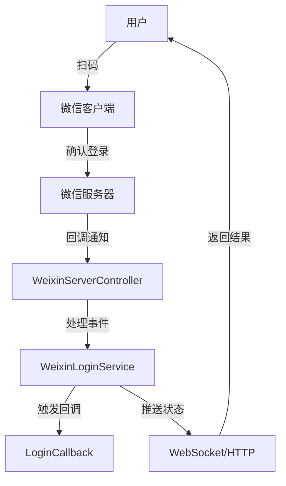

# 📖 原理说明文档

## 🏗️ 项目架构

### 核心模块
```
wxlogin-spring-boot-starter/
├── core/
│   ├── WeixinLoginController.java    # 处理HTTP请求
│   ├── WeixinWebSocketHandler.java   # 处理WebSocket连接
│   ├── WeixinLoginService.java       # 核心业务逻辑
│   └── WeixinServerController.java   # 处理微信服务器回调
├── config/
│   ├── WeixinLoginAutoConfiguration.java  # 自动配置类
│   └── WeixinLoginProperties.java         # 配置属性类
└── callback/
    └── WeixinLoginCallback.java      # 登录回调接口
```

## 🔄 工作流程

### 整体流程图


### 详细流程说明

1. **初始化阶段**
   - Spring Boot 启动时自动配置
   - 读取配置文件中的 appId、appSecret 等信息
   - 初始化 WebSocket（如果启用）

2. **获取登录二维码**
   ```mermaid
   sequenceDiagram
      用户->>WeixinLoginController: 请求二维码
      WeixinLoginController->>WeixinLoginService: 生成场景值
      WeixinLoginService->>微信服务器: 请求临时二维码
      微信服务器-->>WeixinLoginService: 返回二维码ticket
      WeixinLoginService-->>用户: 返回二维码URL
   ```

3. **用户扫码登录**
   ```mermaid
   sequenceDiagram
      用户->>微信客户端: 扫描二维码
      微信客户端->>微信服务器: 确认登录
      微信服务器->>WeixinServerController: 发送登录通知
      WeixinServerController->>WeixinLoginService: 处理登录事件
      WeixinLoginService->>LoginCallback: 触发登录回调
      WeixinLoginService-->>用户: 推送登录结果
   ```

## 🔌 核心组件

### WeixinLoginController
处理 HTTP 请求的控制器，提供以下接口：
```java
@RestController
@RequestMapping("${wxlogin.api-prefix:/wxlogin}")
public class WeixinLoginController {
    // 获取二维码
    @GetMapping("/qrcode")
    public String getQrcode(@RequestParam(required = false) String sceneId)
    
    // 获取场景值
    @GetMapping("/scene-id")
    public String getSceneId()
    
    // 查询登录状态
    @GetMapping("/status")
    public String checkLoginStatus(@RequestParam String sceneId)
}
```

### WeixinWebSocketHandler
处理 WebSocket 连接，实现实时推送：
```java
public class WeixinWebSocketHandler extends TextWebSocketHandler {
    @Override
    public void afterConnectionEstablished(WebSocketSession session)
    
    @Override
    protected void handleTextMessage(WebSocketSession session, TextMessage message)
}
```

### WeixinLoginService
核心业务逻辑处理：
```java
@Service
public class WeixinLoginService {
    // 生成二维码
    public String generateQrcode(String sceneId)
    
    // 处理登录事件
    public void handleLogin(String sceneId, String openid)
    
    // 管理登录状态
    private void updateLoginStatus(String sceneId, String status)
}
```

## 🔐 安全机制

### Token 验证
```java
public class WeixinSignatureVerifier {
    public static boolean verify(String signature, String timestamp, String nonce, String token) {
        // 1. 将token、timestamp、nonce三个参数进行字典序排序
        // 2. 将三个参数字符串拼接成一个字符串进行sha1加密
        // 3. 开发者获得加密后的字符串可与signature对比
    }
}
```

### 场景值管理
```java
public class SceneIdGenerator {
    // 生成唯一场景值
    public static String generate() {
        return UUID.randomUUID().toString().replaceAll("-", "");
    }
}
```

## ⚡️ 性能优化

### 缓存策略
1. **access_token 缓存**
   ```java
   @Component
   public class AccessTokenManager {
       private String accessToken;
       private long expiresTime;
       
       public String getAccessToken() {
           if (isExpired()) {
               refreshAccessToken();
           }
           return accessToken;
       }
   }
   ```

2. **场景值缓存**
   - 使用 Redis 或内存缓存存储场景值与登录状态的映射
   - 设置合理的过期时间，避免内存泄漏

### 连接池管理
- 使用 WebSocket 连接池管理长连接
- 及时清理失效的连接
- 限制最大连接数

## 🔍 调试与监控

### 日志记录
```java
@Slf4j
public class WeixinLoginService {
    public void handleLogin(String sceneId, String openid) {
        log.info("处理登录事件: sceneId={}, openid={}", sceneId, openid);
        // 处理逻辑
    }
}
```

### 状态监控
- 记录关键指标：登录成功率、响应时间等
- 异常监控和告警
- 性能指标收集

## 🎯 扩展机制

### 自定义登录回调
```java
public interface WeixinLoginCallback {
    /**
     * 登录成功时的回调方法
     * @param sceneId 场景值
     * @param openid 用户的openid
     * @return 返回给用户的消息
     */
    String onLoginSuccess(String sceneId, String openid);
}
```

### 配置定制
通过 `WeixinLoginProperties` 支持灵活配置：
```java
@ConfigurationProperties(prefix = "wxlogin")
public class WeixinLoginProperties {
    private String appId;
    private String appSecret;
    private String apiPrefix = "/wxlogin";
    private String verifyPath = "/wxverify";
    // ...
}
```

## 📊 数据流转图



## 🔧 最佳实践

1. **错误处理**
   - 实现全局异常处理
   - 提供友好的错误提示
   - 记录详细的错误日志

2. **安全考虑**
   - 实现请求签名验证
   - 防止重放攻击
   - 保护敏感信息

3. **性能优化**
   - 使用连接池
   - 实现缓存机制
   - 异步处理耗时操作 