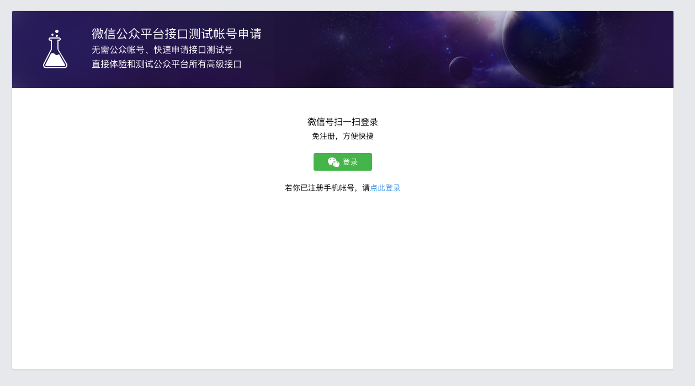
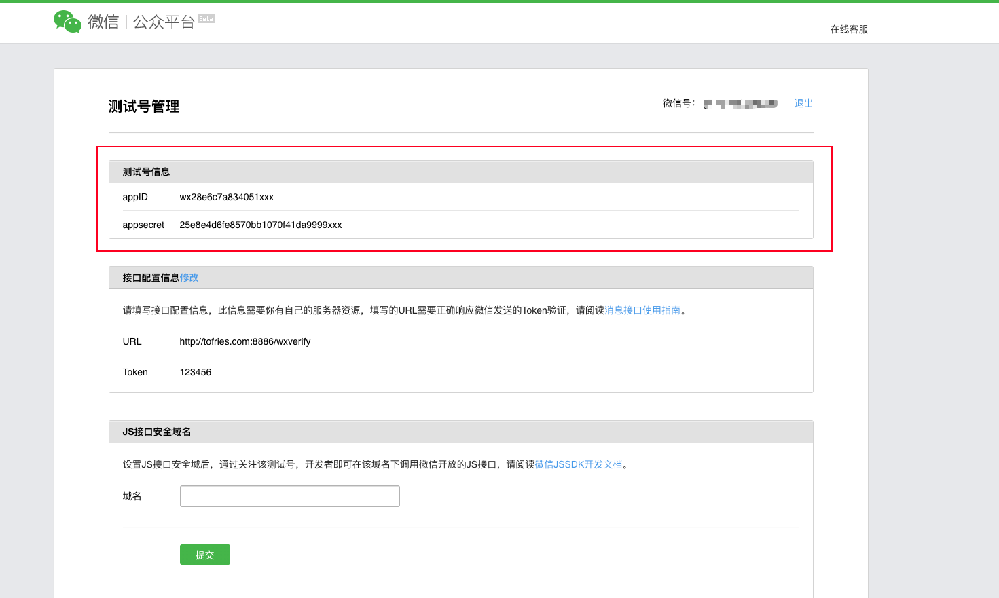
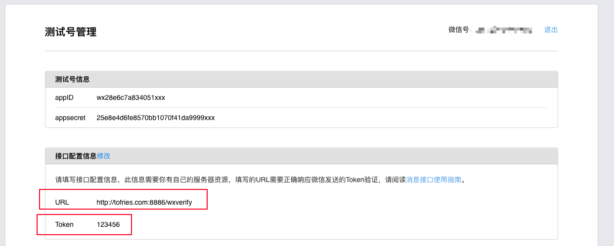
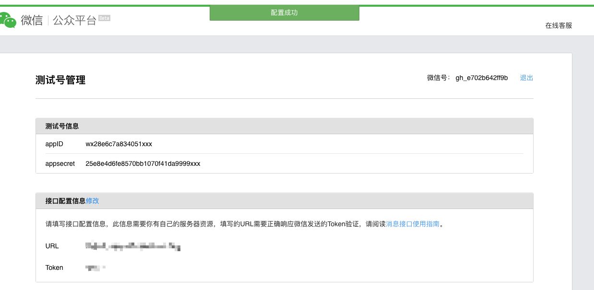
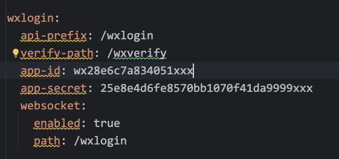
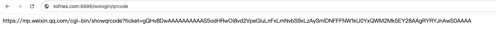
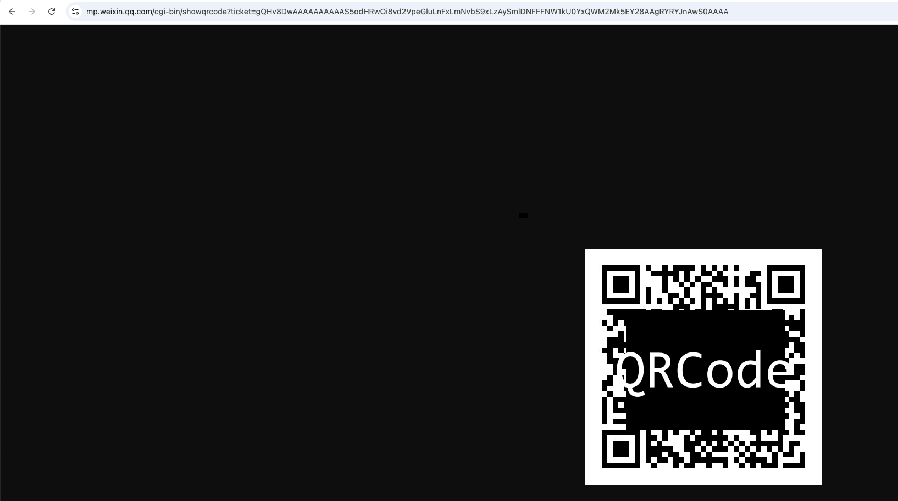

# 🚀 【SpringBoot】5分钟接入微信扫码登录！无需企业认证！无需企业资质！一行依赖实现微信二维码登陆｜个人网站快速集成微信登录指南（ 微信二维码登录/微信扫码登录/微信登陆/SpringBoot/Maven依赖）

还在为接入微信登录需要企业资质而发愁吗？现在无需企业资质，个人开发者也能快速为应用添加微信扫码登录功能！

Hey！这是一个超简单的微信扫码登录 Spring Boot Starter，只需要一行依赖就能为你的项目增加微信扫码登录功能！😎

```xml
<dependency>
    <groupId>com.tofries</groupId>
    <artifactId>wechat-login-spring-boot-starter</artifactId>
    <version>1.0.0</version>
</dependency>
```


## ✨ 为什么选择这个 Starter？

- 🎯 基于微信测试号，无需企业资质
- 🔌 一行依赖，开箱即用
- 🛠️ 自动配置，零代码接入
- 📱 支持 WebSocket 实时推送登录状态
- 🎨 支持自定义登录成功回调
- 🔒 安全可靠的登录流程


## 🚀 三步开始使用

### 1️⃣ 添加依赖

只需在 `pom.xml` 中添加：

```xml
<dependency>
    <groupId>com.tofries</groupId>
    <artifactId>wxlogin-spring-boot-starter</artifactId>
    <version>1.0.0</version>
</dependency>
```

### 2️⃣ 获取并配置微信测试号

> 💡 这一步需要在微信公众平台操作，[点击查看详细配置步骤](#配置微信测试号详细说明)

1. 访问[微信公众平台测试号系统](https://mp.weixin.qq.com/debug/cgi-bin/sandbox?t=sandbox/login)

2. 获取测试号信息（appID和appsecret）

3. 配置接口地址：`http://你的域名/wxverify`

   > 🔔 本地开发？需要配置内网穿透！[点击查看内网穿透配置](#内网穿透配置)

4. 在 `application.yml` 中添加配置：

```yaml
wxlogin:
  app-id: 你的测试号appId
  app-secret: 你的测试号appSecret
```


### 3️⃣ 启动项目，开始使用！

🎉 恭喜！现在你的应用已经具备了微信扫码登录能力！

默认提供以下接口：

- 获取登录二维码：`GET /wxlogin/qrcode?sceneId={sceneId}`
- 获取场景值：`GET /wxlogin/scene-id`
- 查询登录状态：`GET /wxlogin/status?sceneId={sceneId}`

[查看接口详细说明](#接口详细说明)


## 📺 效果展示

[图片占位：展示登录流程的动图或截图序列]

1. 打开登录页面，展示二维码
2. 使用微信扫描二维码
3. 自动完成登录


# 🌟 感谢你看到这里 如果这个项目帮助到你，请给个 Star 支持一下！

###  📖 项目地址：[GitHub](https://github.com/tofries/wxlogin-spring-boot-starter) 	万分感谢🙏


## 💡 使用场景

- 🏠 个人博客登录
- 👥 小型网站会员系统
- 🔧 开发环境测试
- 📚 学习/演示项目
- 🎯 任何需要登录功能的个人项目


## 🚀 项目优势

1. 💫 零门槛：无需企业资质，个人开发者也能用
2. ⚡️ 零配置：Spring Boot 自动配置，无需额外代码
3. 💰 零成本：基于微信测试号，完全免费
4. 🔄 高扩展：提供回调接口，轻松自定义业务逻辑


## 🌟 进阶使用

### 📱 实时获取登录状态（WebSocket）

1. 开启 WebSocket 支持：

```yaml
wxlogin:
  websocket:
    enabled: true
    path: /wxlogin/ws
```

[查看WebSocket详细说明](#WebSocket接口（推荐）)

### 🎨 自定义登录回调

想要在用户登录成功时执行自己的业务逻辑？只需创建一个回调类：

```java
@Component
public class MyLoginCallback implements WeixinLoginCallback {
    @Override
    public String onLoginSuccess(String sceneId, String openid) {
        // 在这里处理登录成功后的业务逻辑
        // 比如：创建用户、生成 token 等
        return "登录成功！";
    }
}
```

### ⚙️ 更多配置选项

```yaml
wxlogin:
  api-prefix: /wxlogin  # 修改接口前缀
  verify-path: /wxverify  # 修改验证路径
  login-message: 登录成功！  # 自定义登录成功消息
  subscribe-message: 感谢关注！  # 自定义首次关注消息
```


## 🛰️ 配置微信测试号详细说明

### 🎯 第一步：获取测试号

1. 📱 用微信扫码登录[微信公众平台测试号系统](https://mp.weixin.qq.com/debug/cgi-bin/sandbox?t=sandbox/login)



2. 🔑 登录成功后，你会看到测试号信息页面



### 🛠️ 第二步：配置接口信息

1. 📝 在页面下方找到"接口配置信息"
2. ⚙️ 填写配置：
   - URL：`http://你的域名/wxverify`
   - Token：可以随意填写，比如：`123456`



> 🔔 注意：
>
> - 如果是本地开发，需要先配置内网穿透
> - URL必须以http://或https://开头
> - 确保Token只包含字母和数字

### 📋 第三步：保存配置

1. 点击"提交"按钮
2. 如果提示"配置失败"，请检查：
   - ✅ 你的服务是否已启动
   - ✅ 内网穿透是否配置正确
   - ✅ URL是否能正常访问



### ⚡️ 第四步：使用配置

1. 在你的项目中创建或修改 `application.yml` 文件
2. 添加以下配置：

```yaml
wxlogin:
  app-id: 这里填写测试号信息页面上的appID
  app-secret: 这里填写测试号信息页面上的appsecret
```



### ✅ 验证配置是否成功

1. 🚀 启动你的SpringBoot应用
2. 📱 访问：`http://你的域名/wxlogin/qrcode`
3. 🔍 访问得到的URL，看见二维码，说明配置成功！





### ❌ 常见问题解决

1. 提示"token验证失败"
   - ✔️ 检查Token是否与配置页面填写的一致
   - ✔️ 确保URL正确且能访问

2. 获取二维码失败
   - ✔️ 检查appID和appsecret是否正确
   - ✔️ 确认应用是否正常启动

3. 扫码无反应
   - ✔️ 检查接口配置是否正确
   - ✔️ 查看应用日志是否有报错

> 💡 提示：配置过程中遇到问题，可以查看应用日志获取详细错误信息


## 🔧 内网穿透配置

本地开发时，微信服务器需要访问到你的本地服务。以下是几种快速配置方案：

1. 使用 ngrok（推荐）：

```bash
# 下载并安装 ngrok 后执行：
ngrok http 8080  # 假设你的应用运行在8080端口
```

2. 使用花生壳：
   - 下载[花生壳客户端](https://hsk.oray.com/)
   - 注册账号并登录
   - 创建新的内网穿透，将本地端口映射到外网域名

3. 使用 natapp：

```bash
# 下载并配置 natapp 后执行：
natapp -authtoken=你的authtoken
```

配置完成后，将获得的外网域名填入微信测试号的接口配置URL中：

```
http://你的外网域名/wxverify
```

> 💡 提示：选择免费的内网穿透服务可能会有连接不稳定的情况，建议在正式环境使用有公网IP的服务器。


## 📚 接口详细说明

### 1. 获取登录二维码

```http
GET /wxlogin/qrcode?sceneId={sceneId}
```

**参数：**

- `sceneId`（可选）：场景值，用于标识登录请求
  - 类型：string
  - 示例：`abc123`
  - 说明：不传则自动生成随机场景值

**返回值：**

- 类型：string
- 说明：返回微信二维码图片的URL
- 示例：`https://mp.weixin.qq.com/cgi-bin/showqrcode?ticket=xxxx`

**使用示例：**

```javascript
// 指定sceneId
fetch('/wxlogin/qrcode?sceneId=abc123')
  .then(response => response.text())
  .then(url => {
    // 显示二维码
    document.getElementById('qrcode').src = url;
  });
```

### 2. 获取随机场景值

```http
GET /wxlogin/scene-id
```

**参数：** 无

**返回值：**

- 类型：string
- 说明：返回随机生成的场景值
- 示例：`abc123`

**使用示例：**

```javascript
fetch('/wxlogin/scene-id')
  .then(response => response.text())
  .then(sceneId => {
    // 保存场景值，用于后续查询登录状态
    localStorage.setItem('sceneId', sceneId);
  });
```

### 3. 查询登录状态

```http
GET /wxlogin/status?sceneId={sceneId}
```

**参数：**

- `sceneId`（必填）：场景值，用于标识登录请求
  - 类型：string
  - 示例：`abc123`

**返回值：**

- 类型：string
- 可能的值：
  - `success`：登录成功
  - `fail`：未登录或登录失败
- 示例：`success`

**使用示例：**

```javascript
// 定期查询登录状态
const checkLoginStatus = (sceneId) => {
  fetch(`/wxlogin/status?sceneId=${sceneId}`)
    .then(response => response.text())
    .then(status => {
      if (status === 'success') {
        // 登录成功，进行页面跳转等操作
        window.location.href = '/dashboard';
      }
    });
};

// 每3秒查询一次登录状态
const sceneId = 'abc123';
const timer = setInterval(() => checkLoginStatus(sceneId), 3000);
```

### 4. WebSocket接口（推荐）

```http
WebSocket /wxlogin/ws
```

**连接示例：**

```javascript
const ws = new WebSocket('ws://你的域名/wxlogin/ws');

ws.onmessage = (event) => {
    const data = event.data;
    if (data.startsWith('http')) {
        // 收到二维码URL
        document.getElementById('qrcode').src = data;
    } else {
        // 收到登录成功消息
        console.log('登录成功：', data);
        window.location.href = '/dashboard';
    }
};

ws.onclose = () => {
    console.log('WebSocket连接已关闭');
};

ws.onerror = (error) => {
    console.error('WebSocket错误：', error);
};
```

> 💡 提示：使用WebSocket可以实时获取登录状态，无需轮询查询接口


## 🤝 需要帮助？

- 📖 查看项目：[GitHub](https://github.com/tofries/wxlogin-spring-boot-starter)
- 🐛 遇到问题？[提交 Issue](https://github.com/tofries/wxlogin-spring-boot-starter/issues)
- 💡 有建议？[Pull Request](https://github.com/tofries/wxlogin-spring-boot-starter/pulls) 随时欢迎！


## 📄 开源协议

本项目采用 MIT 协议开源，欢迎使用和贡献代码！


## 🌟 感谢看到这里，如果这个项目帮助到你，请给个 Star 支持一下！

#SpringBoot #微信登录 #开源项目 #Java开发